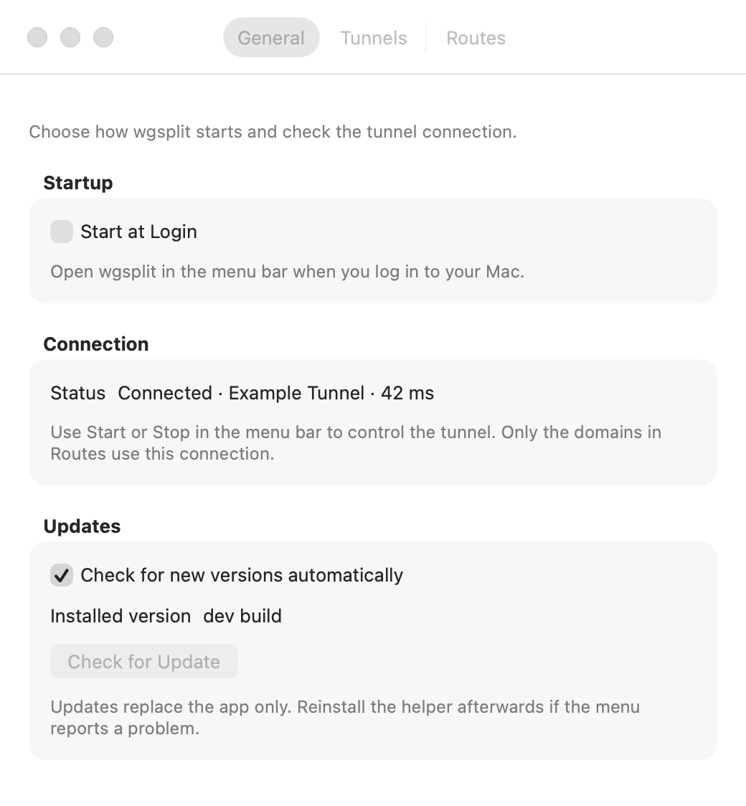
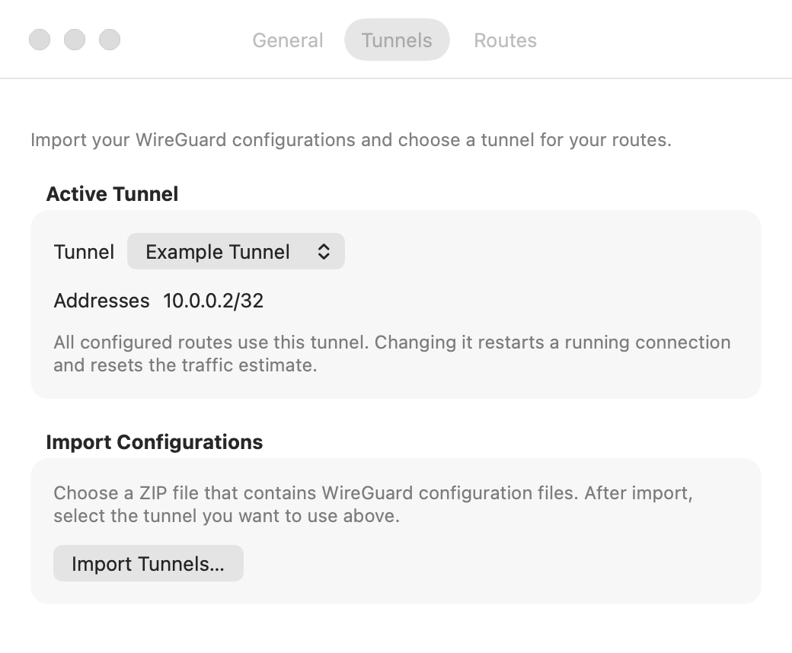
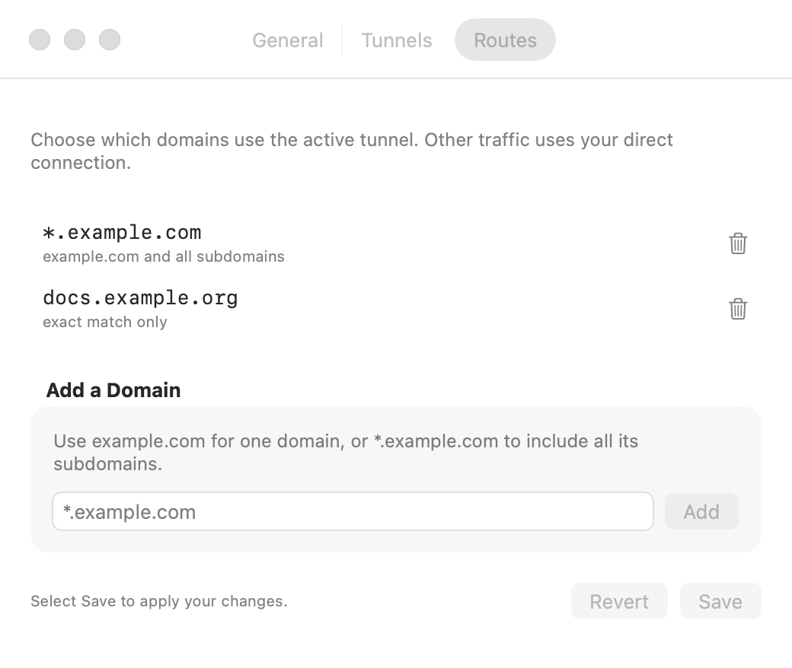

<p align="center">
  
</p>

<h1 align="center">wgsplit</h1>

<p align="center">
  Route chosen domains through a WireGuard tunnel. Everything else goes direct.
</p>

<p align="center">
  
  
  
</p>

wgsplit is a native macOS menu-bar app for split tunneling by **domain name**.
Import a WireGuard export, list the domains that belong on the tunnel, and press
Start. Traffic for those names goes through WireGuard; everything else keeps
using your ordinary connection.

WireGuard routes by IP CIDR and has no concept of domains, which makes a rule
like `*.herokuapp.com` impossible with stock WireGuard — Heroku resolves to
shared, rotating AWS addresses, and any CIDR wide enough to catch them would
capture far more than you want. wgsplit wraps
[sing-box](https://sing-box.sagernet.org/), whose TUN inbound sniffs the TLS SNI
off each connection and routes on the hostname instead.

## Highlights

- Domain patterns instead of CIDRs: `*.niteo.co` is a single rule
- Import tunnels straight from a WireGuard export ZIP
- Active health probing, so the menu tells you whether the tunnel really carries traffic
- Estimated sent and received bytes since the tunnel started
- Validated configuration with automatic rollback if a new config fails to start
- Root daemon that accepts declarative intent only — never a config or a path
- Install the helper from the app with an administrator password
- Start at Login via `SMAppService`
- In-app updates from GitHub Releases, gated on a matching Developer ID signature

## Feature Overview

| Area | What you get |
|---|---|
| Routing | Match traffic by hostname sniffed from TLS, HTTP, and QUIC |
| Tunnels | Import a WireGuard export ZIP and pick the active tunnel |
| Routes | Add, remove, and save domain patterns with over-broad rules rejected |
| Status | Menu-bar shield showing stopped, connected, or connected with latency |
| Traffic | Estimated payload bytes since the tunnel last started |
| Safety | `sing-box check` before apply, plus rollback if startup fails within 5s |
| Install | In-app helper installation with the standard macOS password dialog |
| Startup | Start at Login, when the bundle lives in `/Applications` |
| Updates | Background release check and one-click Install and Relaunch |

## Settings

These screenshots show the app settings with example tunnel and domain data.

### General

Set startup options, check the connection, and manage app updates.



### Tunnels

Import WireGuard configurations and select the active tunnel.



### Routes

Add the domains that must use the tunnel. Other traffic uses the direct connection.



## How It Works

1. Import a WireGuard configuration and choose the active tunnel.
2. List the domain patterns that should use it.
3. The app sends that intent over a Unix socket to the root daemon.
4. The daemon generates a sing-box config, validates it, and starts the process.
5. The menu bar probes the tunnel and reports whether traffic actually flows.

| Component | Runs as | Responsibility |
|---|---|---|
| `WGSplitKit` | library | Parsing, pattern compilation, config generation (pure, tested) |
| `wgsplitd` | root daemon | Owns state, generates config, supervises sing-box |
| `WGSplit.app` | user | Menu-bar client |

The socket protocol carries only declarative intent — which tunnel, which
patterns. If the app could send a config or a config path, socket access would
mean root code execution.

Applying a change runs `sing-box check` first and leaves the running process
alone if it fails. If the new process then dies within 5 seconds, the daemon
rolls back to the last known-good config. `check` passing is necessary but not
sufficient — a config can validate and still fail at startup.

## Requirements

- macOS 14 or later with an administrator account
- A WireGuard configuration export (a ZIP of `.conf` files)
- Xcode command line tools, to build from source

## Install

Check [Releases](https://github.com/dz0ny/wgsplit/releases) for a signed
`WGSplit.dmg`.

1. Open the disk image and move `WGSplit.app` to `/Applications`.
2. Open the app. Select its shield icon in the menu bar, then **Settings…**.
3. In **General → Connection**, select **Install Helper…**.
4. Enter an administrator password in the macOS dialog.

The app installs and starts the daemon (`wgsplitd`) and its tunnel engine.
No terminal command is required. The installation button appears when the app
cannot connect to the helper. If a helper is already connected, continue with
[First Run](#first-run).

Once installed, wgsplit keeps itself up to date: it checks Releases at launch,
verifies a downloaded update is signed by the same Developer ID before
installing it, and offers **Install and Relaunch** in **Settings → General →
Updates** (toggle the automatic check off there if you prefer). An update
replaces the app only — the root helper keeps running the version installed in
`/Library/PrivilegedHelperTools/wgsplit/`. If the app cannot connect to the helper
after an update, use **Settings → General → Connection → Install Helper…**.

If no signed release is listed, build the current version:

```bash
git clone https://github.com/dz0ny/wgsplit.git
cd wgsplit
make run
```

That vendors sing-box, builds, bundles, and launches. Use `make run` rather than
`open dist/WGSplit.app` — `open` will not relaunch an app that is already
running, so a rebuild silently keeps the old process. `make run` quits it first.

To hand the app to someone else, build a disk image:

```bash
make dmg
```

For a source build, install the helper through the app with the same steps.
Move `WGSplit.app` to `/Applications` before you enable **Start at Login**.

| Target | Does |
|---|---|
| `make run` | rebuild and relaunch the app |
| `make build` | build and bundle, no launch |
| `make dmg` | package the bundle into `dist/WGSplit.dmg` |
| `make release` | signed, notarized, stapled app and disk image |
| `make uninstall` | remove the daemon and quit the app |
| `make status` | daemon, socket and tunnel state |
| `make logs` | tail the daemon log |
| `make test` | run the suite |

## First Run

1. Open **Settings…** from the menu, or press **Command-comma**.
2. If **General → Connection** shows **Install Helper…**, select it and enter
   an administrator password. If the helper is connected, continue to step 3.
3. In **Tunnels**, choose **Import Tunnels…**, pick a WireGuard export ZIP, and
   select the active tunnel.
4. In **Routes**, add domain patterns and select **Save**. **Revert** discards
   unsaved changes.
5. Select **Start Tunnel** from the menu.

Helper installation elevates via `osascript` and asks for your password in the
standard macOS dialog — no terminal needed. It copies `wgsplitd` and `sing-box`
to root-owned `/Library/PrivilegedHelperTools/wgsplit/` and loads the
LaunchDaemon. The daemon deliberately runs from that copy, never from inside the
app bundle: root executing a binary in a user-writable location would be a
privilege-escalation path.

## Route Patterns

| Pattern | Matches |
|---|---|
| `*.niteo.co` | `niteo.co` and every subdomain |
| `niteo.co` | `niteo.co` only |

Patterns broader than two labels (`*`, `*.com`) are rejected — a typo there
would route most of the internet through your tunnel.

## Status Reporting

The menu reports three states. Health is an **active probe**: the daemon asks
sing-box's clash_api to time a request through the `wg-out` outbound, so it
measures whether the tunnel actually carries traffic.

| Menu bar icon | Headline | Meaning |
|---|---|---|
| pulsing plain shield | Working… | a request is in flight |
| `lock.shield` | Stopped | sing-box is not running |
| `lock.shield.fill` | Connected · not passing traffic | up, but the probe fails — e.g. a wrong key |
| `checkmark.shield.fill` | Connected · Niteo DE · 42 ms | probe succeeded, with measured latency |

An earlier version counted live connections via `/connections`, which was wrong:
that endpoint lists only currently-open connections, so ordinary short requests
finished before any poll could see them. The probe is deterministic and, unlike
connection counting, actually detects a broken tunnel.

The probe runs at most every 20s, off the request thread, so a status query never
blocks on the network.

clash_api is bound to `127.0.0.1` on a random high port with a random secret,
generated once and persisted `0600` beside `state.json`. Only the daemon reads
it; it is never exposed over the control socket.

## Tunnel Data

The menu shows estimated sent and received payload bytes since the tunnel last
started. The helper samples open connections once per second and counts only
connections routed through `wg-out`. Observed bytes remain in the totals after
connections close. The menu updates with the existing three-second status check.

These are estimates: short connections and bytes transferred after the last
sample can be missed. WireGuard overhead and internal health probes are not
included. Totals reset when the tunnel restarts, including after a tunnel or
routing change. If counters cannot be read, the menu shows "Tunnel data
unavailable".

## Known Limitations

- Only sniffable protocols (TLS, HTTP, QUIC) can be routed by name. A raw TCP
  connection to a bare IP has no hostname and falls through to direct.
- `AllowedIPs` in imported configs is ignored by design; domain rules decide routing.

## Development

### Xcode

Open `WGSplit.xcodeproj` to build and configure the macOS app. Opening
`Package.swift` only shows the Swift package and does not provide app signing settings.

1. Run `make singbox` once to download the required engine.
2. Open `WGSplit.xcodeproj` and select the **WGSplit** scheme.
3. Select the **WGSplit** target, then **Signing & Capabilities**.
4. Select your development team. Set the same team on the **wgsplitd** target.
5. Select **My Mac**, then build or run. Use **Product → Archive** for distribution.

The project builds the library and daemon, adds the app icon and helper files,
and signs the app with the selected settings. Set the release version and build
number in the app target before an archive. Tests remain available through `swift test`.

```bash
swift test                    # full suite
./Scripts/vendor-singbox.sh   # required for SingBoxCheckTests
```

`SingBoxCheckTests` pipes generated config through the real pinned binary. It is
the test that catches a sing-box upgrade breaking the config schema.

Command-line builds take their version from `git describe`. Builds with a
version that cannot be parsed do not offer updates. Xcode builds use the version
and build number in the app target.

## Publishing a Release

Pushing a tag runs `.github/workflows/release.yml`, which signs with a Developer
ID certificate, notarizes, staples, and publishes a GitHub Release with
`WGSplit.dmg` and `WGSplit.app.zip` (the asset the in-app updater downloads).

```bash
git tag v0.2.0 && git push origin v0.2.0
```

It needs these repository secrets:

| Secret | Value |
|---|---|
| `MACOS_CERT_P12` | base64 of the "Developer ID Application" `.p12` |
| `MACOS_CERT_PASSWORD` | password for that `.p12` |
| `MACOS_SIGN_ID` | `Developer ID Application: NAME (TEAMID)` |
| `APPLE_ID` | Apple ID email |
| `APPLE_TEAM_ID` | 10-character team id |
| `APPLE_APP_PASSWORD` | app-specific password for `notarytool` |

Upload them with:

```bash
./Scripts/set-release-secrets.sh
```

It prompts for each value, base64-encodes the certificate for you, and pipes
everything to `gh secret set` without writing anything to disk. Values already
exported in the environment are used as-is, so a password manager can drive it.

The same thing runs locally:

```bash
make release SIGN_ID="Developer ID Application: NAME (TEAMID)" \
  APPLE_ID=you@example.com TEAM_ID=TEAMID APP_PW=app-specific-password
```

## Uninstall

```bash
sudo ./Scripts/uninstall-daemon.sh
```
